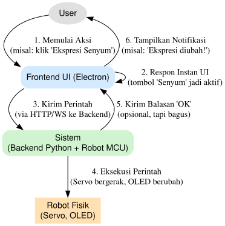
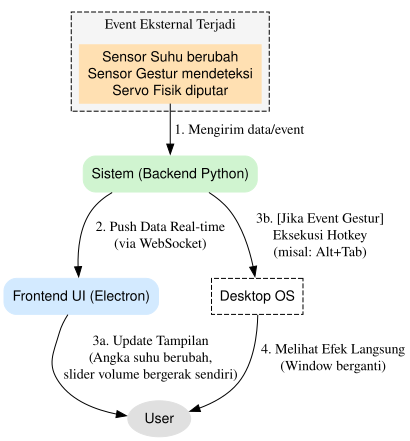

 
# 🤖 Bit-Ty: Interactive Desktop Assistant Project Plan

Welcome to the **Bit-Ty** repository! This is a planning document for building a DIY interactive desktop assistant robot. It outlines the idea, proposed architecture, and planned components for the project.

---

## 💡 Idea & Primary Goals

The goal of this project is to design and build **Bit-Ty**, a small robot that sits on your desk and interacts with your desktop/laptop.

**Core Design Principles:**
1.  **User Convenience:** The robot must connect to the laptop with a **single USB cable**.
2.  **Stability:** The connection must be stable without sacrificing functionality.
3.  **Responsiveness:** The robot should provide instant feedback, both physically and digitally.

Bit-Ty acts as a physical “companion” for your computer, able to express “emotions,” respond to gesture touch, and even help you control system volume physically.

---

## ✨ Planned Features

* **Facial Expressions:** Display various expressions on an OLED screen.
* **Gesture Control:** Use an APDS-9960 sensor to detect gestures (swipe right/left/up/down) mapped to OS shortcuts (e.g., Alt+Tab).
* **Physical Volume Control:** A unique feature where a hand servo is “hacked” to read manual rotation from the user, which is then translated into desktop volume control.
* **Temperature Monitoring:** Read and display the current room temperature via DHT11.
* **Voice Commands:** Implement on-device Keyword Spotting (KWS) on the ESP32. After the keyword is detected, audio is streamed to the desktop for further processing (ASR).
* **4-Axis Motion:** Four servos (2 arms, 1 head, 1 body) for expressive movement.

---

## 🛠️ Tech Stack (Planned)

* **Firmware (Robot):** **C++** (Arduino Framework)
* **Backend (Desktop):** **Python** & **Flask**
* **Frontend (Desktop):** **Electron** (as an application wrapper)
* **UI (Frontend):** **Next.js** (exported as static files)

---

## 🏗️ Proposed Architecture

Bit-Ty’s architecture is built around two priorities: **power stability** and **responsive data connectivity**.

### 1. Physical & Power Architecture (Single Cable)

This design intentionally avoids a buck converter or the need for two cables.
* **Source:** 1x Laptop USB port.
* **Cable Function:** The USB cable carries both **Power (5V)** and **Data (Serial)**.
* **Stabilizer (Critical!):** A **1000µF capacitor** (or larger) is placed in parallel across 5V and GND. It acts as a “bucket” to buffer **peak current** from servos, preventing the ESP32 from browning out or rebooting.

### 2. Logic & Data Architecture (Serial-First)

The system has 3 primary actors:

1.  **Frontend (Electron UI):** The “face” of the app seen by users. Its job is to send commands (e.g., “change expression”) to the Backend on `localhost`.
2.  **Backend (Flask):** The “brain” and main “bridge.”
    * On startup, the Backend **searches for Bit-Ty on a Serial (USB) port** first.
    * If found, all communication is fast over Serial (`pyserial`).
    * If not found (e.g., cable unplugged), it switches to a fallback mode and **searches for Bit-Ty over WiFi**.
    * It also executes OS shortcuts (via `pyautogui`) when receiving gesture events.
3.  **Firmware (ESP32):** The “worker.”
    * In its `loop()`, it always **checks for a Serial connection** first.
    * If Serial is connected, all sensor data (temperature, gestures) is sent via `Serial.println()`.
    * If Serial is not connected, it enables WiFi and sends data via WebSocket.

---

## 🔌 Planned Hardware Components

| Category | Component | Notes |
| :--- | :--- | :--- |
| **MCU** | Wemos D1 Mini ESP32 | Main controller (Dual-Core) |
| **Servo** | 4x Servo (SG90) | 2 Arms, 1 Head, 1 Body |
| **Display** | OLED SSD106 (I2C) | For facial expressions |
| **Sensor** | APDS-9960 (I2C) | Gesture sensor |
| **Sensor** | DHT11 | Temperature & humidity sensor |
| **Audio In** | INMP441 (I2S) | Microphone for KWS (Keyword Spotting) |
| **Audio Out** | PAM8403 + Speaker | For audio responses |
| **Power** | **1000µF 16V Capacitor** | Servo power stabilizer |

---

## 🔴 Design Principles (Must-Follow) 🔴

This plan will only succeed if these two design principles are strictly followed in implementation:

1.  **Capacitor Placement:** Failing to install the 1000µF capacitor will cause the ESP32 to brown out whenever a servo moves. This is a non-optional component in this design.
2.  **Servo Queue Management:** Due to USB power limits, the firmware **MUST** be programmed to **never** move 2 or more servos simultaneously. There must be a queue for movement commands executed one-by-one. The “dance” (simultaneous movement) feature is intentionally omitted for stability.

---

## 🗺️ Implementation Roadmap

- [ ] **Phase 1 – Minimum Hardware Prototype:** Servos, sensors, OLED, and the 1000µF capacitor are neatly assembled on a breadboard/chassis.
- [ ] **Phase 2 – Serial-First Firmware:** Implement servo queuing, periodic sensor reads, and WiFi fallback as shown in `diagram-serial-connection.svg`.
- [ ] **Phase 3 – Backend & Desktop UI:** Flask detects Bit-Ty via serial, provides WebSocket for Electron, and exposes gesture/volume controls.
- [ ] **Phase 4 – UX & QA:** Refine expressions, map gestures to OS hotkeys, perform power stress and long-run tests.

This roadmap can be extended by marking (`[x]`) each phase as complete.

## 🔄 Interactive System Flow

Bit-Ty has two main interaction paths between the user, desktop app, and the physical robot. The rough diagrams are stored under `/docs/diagram`.

1. **User → System:** The user sends commands from the Electron UI; the backend executes commands to the firmware, and the robot reacts physically. Full diagram: `diagram-user-to-system.svg`.
2. **System → User:** Sensor changes or robot-driven actions are forwarded to the backend and then surfaced as visual/OS feedback. Full diagram: `diagram-system-to-user.svg`.

## 🔗 Serial-First Connection Logic

The connection priority is described in `diagram-serial-connection.svg` and summarized as follows:

- The backend always scans serial ports first and locks into `SERIAL` mode when Bit-Ty is detected.
- If serial fails, the backend sets `WIFI` mode and searches for Bit-Ty via mDNS as a fallback.
- The firmware checks `Serial.available()` inside the `loop()`; if there is no serial connection, it enables WiFi and sends data via WebSocket.
- All sensor telemetry is sent via `Serial.println()` when the USB cable is connected to keep latency low.

## ⚡ Power Management & Load Distribution

The `diagram-power-arcitecture.svg` documents the power distribution strategy from a single USB port:

- A single USB cable supplies 5V and serial data to the ESP32 (Wemos D1 Mini).
- A 1000µF capacitor in parallel on the 5V rail buffers servo peak current; this component is mandatory.
- PWM lines to the four servos must be scheduled alternately to prevent simultaneous peak currents.
- I2C/I2S peripherals (OLED, APDS-9960, DHT11, INMP441) and the PAM8403 amplifier share the stabilized 5V source.
- Consider staged load testing: start with one moving servo, then add peripherals to ensure the laptop USB port does not exceed current limits.

## 🧪 Initial Test Plan

- **Static & Dynamic Power Tests:** Monitor the 5V rail while servos move alternately to ensure there are no brownouts.
- **Servo Queue Verification:** Run a script that triggers many movement commands and ensure servos always move one-by-one.
- **Gesture to Hotkey Tests:** Simulate each APDS-9960 gesture and ensure the backend maps them to correct OS hotkeys.
- **Serial→WiFi Fallback Test:** Unplug the USB cable while the system is running to ensure both backend and firmware switch to WiFi mode without crashing.
- **UI Latency Check:** Measure the time for sensor changes to appear in the UI to ensure responsiveness (<200 ms initial target).

## 🤝 Contributing

1. Open a new issue for each feature idea or bug found.
2. Attach relevant diagrams or logs to keep discussions focused.
3. Submit a pull request with a brief description of the changes, test steps performed, and update the roadmap checklist if needed.

## 📄 License

License not yet determined. Add a license file (e.g., MIT/BSD) before public release to clarify distribution rights.